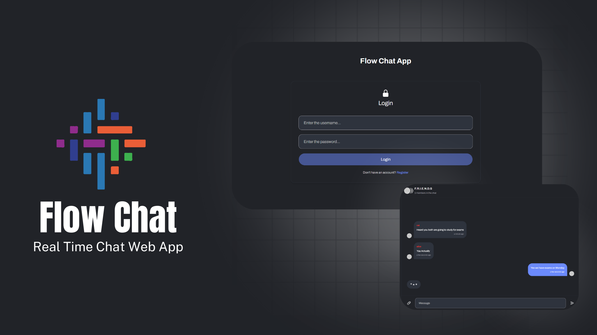
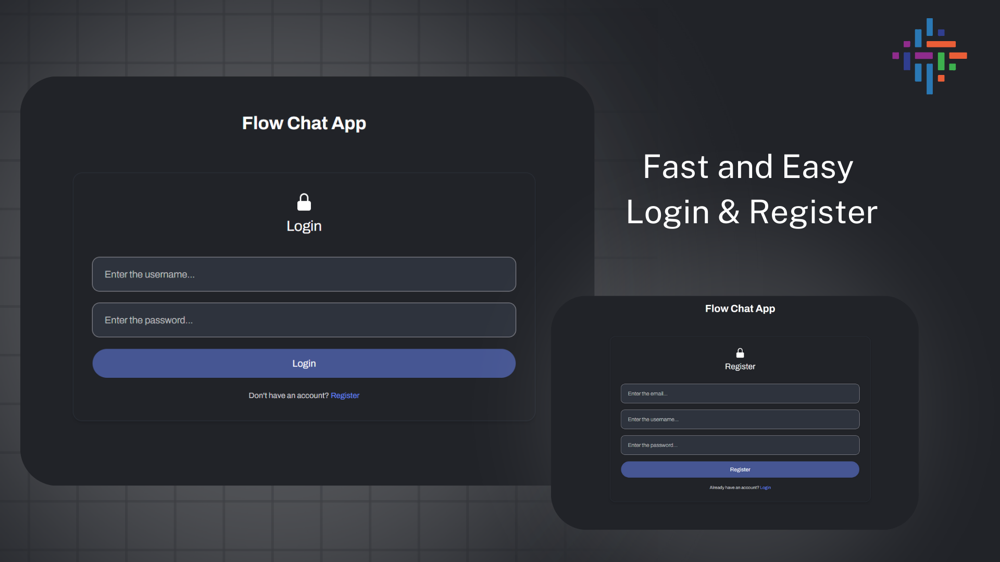
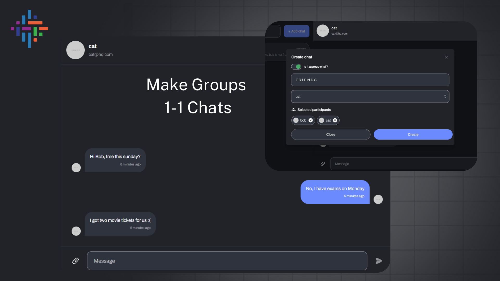
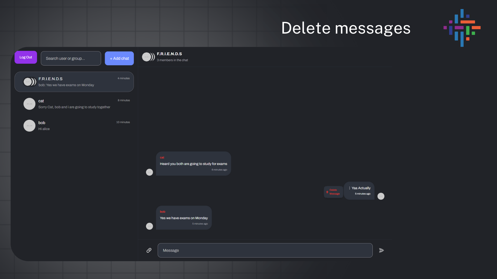
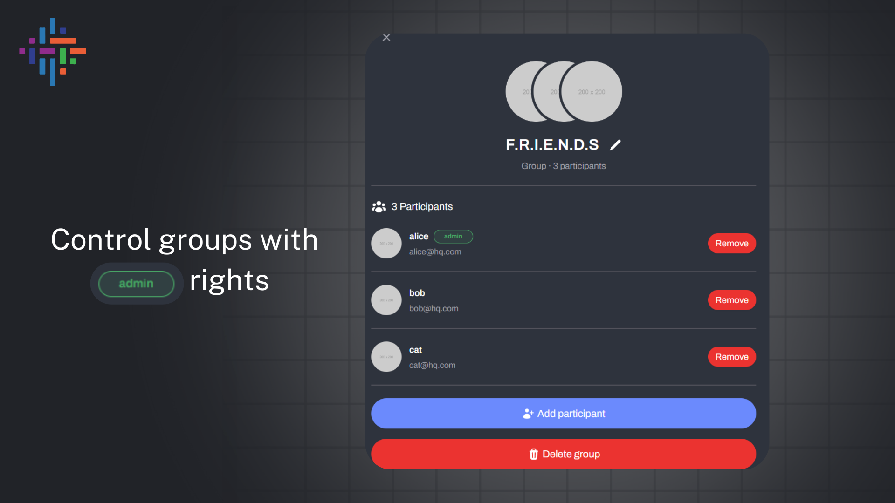

# FlowChat

**Version**: 1.0.0

**Live Link**: https://flow-chat-iby-frontend.vercel.app/login

**Description**: FlowChat is a real-time chat web application that provides a platform for users to send real-time messages to each other. The application includes user authentication, private messaging, message history, and real-time communication through WebSockets.

## Author

**Name**: Anurag Amchi  
**Department**: Mathematics and Computing      
**University**: Indian Institute of Technology Ropar
## Snapshots







## Table of Contents
1. [Overview](#overview)
2. [System Architecture](#system-architecture)
   - [Components](#components)
   - [Data Flow](#data-flow)
3. [Technologies and Dependencies](#technologies-and-dependencies)
   - [Frontend](#frontend)
   - [Backend](#backend)
4. [Authentication Design](#authentication-design)
   - [Signup Flow](#signup-flow)
   - [Login Flow](#login-flow)
   - [Token Verification Middleware](#token-verification-middleware)
5. [Real-Time Messaging System](#real-time-messaging-system)
6. [Database Design](#database-design)
7. [Setup and Run Instructions](#setup-and-run-instructions)
   - [Prerequisites](#prerequisites)
   - [Project Setup](#project-setup)
   - [Additional Setup](#additional-setup)
8. [Libraries and Rationale](#libraries-and-rationale)

## Overview

FlowChat is a client-server web application that enables users to communicate through real-time messaging. The application uses modern web technologies like REST APIs and WebSockets to ensure scalable and efficient real-time communication.

## System Architecture

### Components

1. **Client (Frontend)**:
   - Manages user interface (UI) and communication with the server.
   - Uses REST APIs for authentication and WebSockets for real-time messaging.

2. **Server (Backend)**:
   - Handles business logic, authentication, and routing.
   - Facilitates WebSocket connections for real-time message exchange.
   - Utilizes MongoDB for storing user data and messages.

3. **Database**:
   - Stores user information, chat messages, and authentication data.
   - NoSQL database (MongoDB) used for handling document-based data.

4. **WebSocket Communication**:
   - Provides full-duplex communication for real-time messaging.
   - Uses Socket.IO for managing WebSocket connections.

### Data Flow

1. **Authentication Flow**:
   - User signs up or logs in using a username and password.
   - A JWT (JSON Web Token) is generated and sent to the client for future API requests.
   - The client attaches the JWT to all subsequent requests for validation.

2. **Messaging Flow**:
   - Upon login, the client opens a WebSocket connection.
   - Messages sent by users are broadcasted to the respective recipient in real-time via WebSockets.
   - The server stores all messages in the database.

## Technologies and Dependencies

### Frontend

- **React.js**: For building the user interface.
- **Socket.IO Client**: Handles WebSocket communication for real-time messaging.
- **Axios**: HTTP client for handling API requests.

### Backend

- **Node.js with Express.js**: Manages API routes, authentication, and WebSocket handling.
- **Socket.IO**: Facilitates real-time communication between the client and server.
- **JWT (JSON Web Token)**: Provides token-based authentication.
- **Bcrypt**: Hashes passwords securely before storing them.
- **MongoDB (with Mongoose)**: NoSQL database for storing user profiles and chat messages.

## Authentication Design

### Signup Flow
1. User submits their username and password.
2. The backend hashes the password using Bcrypt and saves the user data in MongoDB.
3. A success message is returned to the client.

### Login Flow
1. User sends their username and password for authentication.
2. The server verifies the password using Bcrypt.
3. If successful, a JWT is issued to the client for future API requests.

### Token Verification Middleware
- All protected routes verify the JWT before processing the request.

## Real-Time Messaging System

The messaging system uses Socket.IO for real-time communication. Once the user is authenticated, they initiate a WebSocket connection. Messages are broadcast to the server, which relays them to the intended recipient in real-time.

## Database Design

### User Schema
```js
const userSchema = new mongoose.Schema({
  username: { type: String, unique: true, required: true },
  password: { type: String, required: true }
});
```

### Message Schema
```js
const messageSchema = new mongoose.Schema({
  sender: { type: mongoose.Schema.Types.ObjectId, ref: 'User', required: true },
  recipient: { type: mongoose.Schema.Types.ObjectId, ref: 'User', required: true },
  content: { type: String, required: true },
  timestamp: { type: Date, default: Date.now }
});
```

## Setup and Run Instructions

### Prerequisites

- **Node.js**: v14+
- **MongoDB**: v4.x+ (or use MongoDB Atlas)
- **Mailtrap**: (for email service setup)

### Project Setup

1. **Clone the Repository**:
   ```bash
   git clone https://github.com/Anurag-Amchi/flow-chat-iby.git
   cd flow-chat-iby
   ```

2. **Install Dependencies**:
   Install all necessary dependencies for the project:
   ```bash
   npm install
   ```

3. **Environment Setup**:
   Create a `.env` file in the root directory and add the following:

   ```
   PORT=8080
   MONGO_MEMORY_SERVER_PORT=10000
   MONGODB_URI=mongodb+srv://<username>:<password>@cluster0.<db>.mongodb.net/?retryWrites=true&w=majority&appName=Cluster0
   NODE_ENV=development
   EXPRESS_SESSION_SECRET=Enter your secret key

   ACCESS_TOKEN_SECRET=Enter your secret key
   ACCESS_TOKEN_EXPIRY=1d
   REFRESH_TOKEN_SECRET=Enter your secret key
   REFRESH_TOKEN_EXPIRY=10d
   CORS_ORIGIN=http://localhost:3000
   FLOWCHAT_HOST_URL=http://localhost:8080

   MAILTRAP_SMTP_HOST=_mailtrap_smtp_host_
   MAILTRAP_SMTP_PORT=_mailtrap_smtp_port_
   MAILTRAP_SMTP_USER=_mailtrap_smtp_user_id_
   MAILTRAP_SMTP_PASS=_mailtrap_smtp_user_password_

   CLIENT_SSO_REDIRECT_URL=http://localhost:3000/user/profile
   FORGOT_PASSWORD_REDIRECT_URL=http://localhost:3000/forgot-password
   ```

   Replace the `MAILTRAP_SMTP_*` values with your actual Mailtrap credentials for email functionality.

4. **Run MongoDB**:
   Start the MongoDB service locally or ensure MongoDB Atlas is connected:
   ```bash
   mongodb
   ```

5. **Run the Server**:
   Start the backend server in development mode:
   ```bash
   npm run server
   ```

6. **Run the Client**:
   Navigate to the client directory and start the frontend React app:
   ```bash
   npm start
   ```

### Additional Setup

- **MongoDB Atlas**: If you're using MongoDB Atlas, ensure the `MONGODB_URI` in your `.env` file is correctly set with your cluster details.
- **JWT Secrets**: Make sure `ACCESS_TOKEN_SECRET` and `REFRESH_TOKEN_SECRET` are securely set in the `.env` file for token management.
- **CORS Configuration**: Ensure the `CORS_ORIGIN` matches the frontend URL, which is `http://localhost:3000` for local development.

## Libraries and Rationale

### Node.js & Express.js
- **Why**: Node.js is efficient for real-time applications, and Express.js simplifies server-side development and routing.

### Socket.IO
- **Why**: Provides easy real-time WebSocket communication, and handles protocol fallbacks when WebSockets aren't available.

### MongoDB with Mongoose
- **Why**: MongoDB's NoSQL structure allows for flexible data storage, and Mongoose offers schema-based modeling and validation.

### JWT & Bcrypt
- **Why**: JWT enables secure, stateless token-based authentication, while Bcrypt ensures password safety through hashing.
